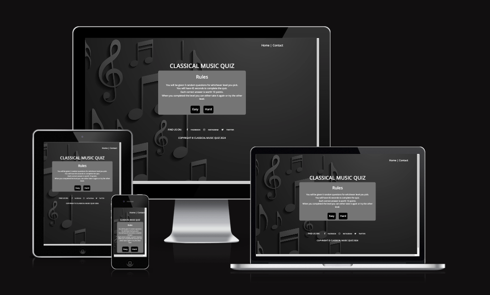

# Classical Music Quiz

[View Classical Music Quiz Website](https://charlieburton10.github.io/classicalmusicquiz/)

---

## CONTENTS
* [Rationale](#rationale)

* [User Experience](#user-experience-ux)
  * [Site Goals](#site-goals)
  * [User Stories](#user-stories)

* [Design](#design)
  * [Colour Scheme](#colour-scheme)
  * [Typography](#typography)
  * [Imagery](#imagery)
  * [Wireframes](#wireframes)

* [Features](#features)
  * [General Features on Each Page](#general-features-on-each-page)
  * [Future Implementations](#future-implementations)
  * [Accessibility](#accessibility)

* [Technologies Used](#technologies-used)
  * [Languages Used](#languages-used)
  * [Frameworks, Libraries & Programs Used](#frameworks-libraries--programs-used)

* [Deployment & Local Development](#deployment--local-development)
  * [Deployment](#deployment)
  * [Local Development](#local-development)
    * [How to Fork](#how-to-fork)
    * [How to Clone](#how-to-clone)

* [Testing](#testing)

* [Credits](#credits)
  * [Code Used](#code-used)
  * [Content](#content)
  * [Media](#media)
  * [Acknowledgments](#acknowledgments)

---
## Rationale
An opportunity to test and enhance your classical music with this 2 level quiz. Whether you are a beginner or and experienced musician, this quiz is designed to challenge and help expand your classical music knowledge. 

With a 40 questions spread over 2 levels of difficulty, easy or hard, the user will be given a random 5 questions, worth 10 points a question and 45 seconds to complete the quiz.

## User Experience (UX)

### Site Goals
* I want the userbto be able to view the site on a range of device sizes.
* I want the site to be attractive, responsive and easy to use for the user.
* I want the site to work as intended incrementing the questions and score as the user progresses, with the timer going down for each question.
* I want the user to have a varied choice of questions.
* I want the site to be user friendly and for all ages.

### User Stories

#### First Time Visitor Goals

* I want to be able to understand the rules.
* I want to be able to navigate the site easily to find information.
* I want to be able to find their social media pages.
* I want the game to be responsive to whichever device I am playing it on.
* I want to be given a choice of varied questions.

#### Returning/Frequent Visitor Goals

* I want to be able to progress on to the hard level.
* I want to be given varied questions each time I play
* I want to be able to easily follow them on social media pages.

## Design

### Colour Scheme

The website uses a palette of black and white to depict sheet music. The colour palette was created using the [Coolors](https://coolors.co/) website.

### Typography

I have used Open Sans from Google Fonts for this website. It is a serif font.

### Imagery

The background image has been been pick for it's classic look. I have credited this at the end.

### Wireframes

Wireframes were created for mobile, tablet and desktop.

## Features

The website is comprised of a home page, a quiz page, a contact page & an end page.

### General features on each page

All Pages on the website are responsive and have:

* A favicon in the browser tab.

* All Pages on the website have:

  * To the right of the navigation bar are the links to the websites pages. 

    

  * In the middle is the Title and tag line.

    

  * A footer which contains social media icon links to Facebook, Instagram and Twitter. 

    

* Home Page

  * Explains the rules of the game.
  * Option buttons - for easy or hard quiz

* Quiz Page

  * Runs the quiz.
  * Has a timer, question counter and score counter.
  
* Contact Page

  * Has a form for users to send us their comments.

* End Page

  * Gives user their final score.
  * Offers them to retake current level or try a different level of quiz.

### Future Implementations

* Add a leaderboard.
* Add more questions.

### Accessibility

 * I have made sure there is colour contrast on the site. 
 * I have used semantic HTML. 
 * I have used a hover state on all buttons on the site to make it clear to the user if they are hovering over a button.

## Technologies Used

### Languages Used

* HTML, CSS and JavaScript were used to create this website.

### Frameworks, Libraries & Programs Used

* [Balsamiq](https://balsamiq.com/) - Used to create wireframes.

* [Git](https://git-scm.com/) - For version control.

* [Github](https://github.com/) - To save and store the files for the website.

* [GitPod](https://gitpod.io/) - IDE used to create the site.

* [Google Fonts](https://fonts.google.com/) - To import the fonts used on the website.

* [jQuery](https://jquery.com/) - A JavaScript library.

* [Google Developer Tools](https://developers.google.com/web/tools) - To troubleshoot and test features, solve issues with responsiveness and styling.

* [TinyPNG](https://tinypng.com/) To compress image.

* [Image Resizer](https://imageresizer.com/) To resize image.

* [Favicon.io](https://favicon.io/) To create favicon.

* [Am I Responsive?](http://ami.responsivedesign.is/) To show the website image on a range of devices.

* [Webpage Spell-Check](https://chrome.google.com/webstore/detail/webpage-spell-check/mgdhaoimpabdhmacaclbbjddhngchjik/related) - a google chrome extension that allows you to spell check your webpage. Used to check the site and the readme for spelling errors.

## Deployment & Local Development

### Deployment

Github Pages was used to deploy the live website. The instructions to achieve this are below:

1. Log in to Github.
2. Find the repository for this project, classicalmusicquiz.
3. Click on the Settings button.
4. Click on the Pages button in the left hand side bar.
5. In the Source section, choose main from the drop down select branch menu. Select Root from the drop down select folder menu.
6. Click Save. Your live Github Pages site is now deployed at the URL shown.

### Local Development

The local development section gives instructions on how someone else could make a copy of your project to play with on their local machine. This section will get more complex in the later projects, and can be a great reference to yourself if you forget how to do this.

#### How to Fork

To fork classicalmusicquiz repository:

1. Log in to Github.
2. Go to the repository for this project, CharlieBurton10/classicalmusicquiz
3. Click the Fork button at the top of the page between Watch and Starred.

#### How to Clone

To clone classical music quiz repository:

1. Log in to Github.
2. Go to the repository for this project, CharlieBurton10/classicalmusicquiz
3. Click on the code button, select whether you would like to clone with HTTPS, SSH or GitHub CLI and copy the link shown.
4. Open the terminal in your code editor and change the current working directory to the location you want to use for the cloned directory.
5. Type 'git clone' into the terminal and then enter.
6. Then paste link from step 3 ($ git clone https://github.com/CharlieBurton10/classicalmusicquiz) and then press enter.

## Testing

Testing has been on going throughout the build with Chrome developer tools.

### W3C Validator

The W3C validator was used to validate the HTML on all pages of the website. It was also used to validate CSS in the style.css file.

[Index Page HTML](docs/testing/w3cindex.png) - Passed

[Quiz Easy Level Page HTML](docs/testing/w3cquizeasy.pgn) - Passed

### Solved Bugs
1. The About Us section on the home page was not fitting properly when it was on a medium screen. So I changed the bootstrap grid system to large.
2. The images when on a medium device were overlapping with text. I fixed this by changing the bootstrap grid system from small to medium.
 
3. I had adjusted the Google Maps width to 100% to make the page responsive. The error was the % sign on the iframe code. I have reinserted a new link to Google Maps to clear the error and then put a paragraph aboud the iframe to be able to center the map allowing it to be more responsive. For the warning I just changed the section to a div.

### Known Bugs

On the Chrome developer tool, it comes up with 6 warnings and 24 verbose for the Google Maps link. The 6 warnings are regarding third party cookies will be blocked. The 28 verbose are for "Added non-passive event listener to a scroll-blocking event. Consider marking event handler as 'passive' to make the page more responsive." When researching and looking on slack I was unable to find a solution without using JavaScript. As I don't have any experience so far with JavaScript this is currently unable to implement, but would be able to update it in the future.

### Testing User Stories

#### First Time Customers Goals

* I want to find out what Waggy Tail Lodge offers.
    * Our Services page explains what the Waggy Tail Lodge offers including prices and specials.

* I want to be able to navigate the site easily to find information.
    * All site navigation is in the top right corner on every page of the website.

    
* I want to be able to find their social media pages.
    * In the footer on every page sits links to the social media pages.

    
* I want to be able to book a trial.
    * On the Book Now! page this is an option to select what you are booking.

    
* I want to be able to read about current customers reviews.
    * On the Home page there are some testimonials from 4 customers.

    

#### Returning Customer Goals

* I want to book online instead of phoning Waggy Tail Lodge - to help with ease.
    * On the nav bar is a Book Now! button that takes them to a form to complete with details of the booking.

    
* I want to find up-to-date prices and special offers. 
    * On the Our Services page, the prices and specials offers sit.

    
* I want to be able to easily follow them on social media pages to get dog updates.
    * In the footer on every page sits links to the social media pages.

    

### Further Testing

 * The website was tested on Google Chrome, Safari and Microsoft Edge browsers.
 * The website was tested on multiple devices: Desktop, Mackbook 14inch, iPad Pro and iPhone 14.
 * All browsers and devices were tested on all pages to make sure all the pages and links are working properly.

 #### Testing Forms

 1. Tested the Subscribe to our Newsletter and Book Now! forms and both need linking to a database.
 2. I tried to test the Book Now! form it requires one of the custom radio buttons to be selected, and all other fields to be completed to be able to submit the form, except 2nd Dog Name and 3rd Dog Name as not every customer will be checking in more than 1 dog.

## Credits

### Code Used

* [SitePoint](https://www.sitepoint.com/simple-javascript-quiz/#thebasicstructureofyourjavascriptquiz) Countdown timer for the quiz.

### Tutorials

*  [James Q Quick](https://www.youtube.com/playlist?list=PLDlWc9AfQBfZIkdVaOQXi1tizJeNJipEx) YouTube course was used to help me create this game. It provided a strong foundation to build on to help me achieve the results I wanted. 

###  Background Image

* [Freepik](https://img.freepik.com/free-vector/vector-abstract-musical-background-vector-illustration_206725-624.jpg?t=st=1721989267~exp=1721992867~hmac=2878b2832f83df143a5040ea248d5c22c5d3bd7c1e52420aad3349896554bd33&w=1380) Image by almumtazza on Freepik.

### Quiz questions

* [Sporcle](https://www.sporcle.com/games/biggs364/classical-music-easy-to-hard) Questions for both easy and hard.

  
###  Acknowledgments

 * My Code Institute Mentor, Can Sucullu for his helpful feedback and support.
 * Subsitute Code Insistue Mentor, Tim Nelson for his helpful feedback and support.
 * Tutor Support at Code Institute.
