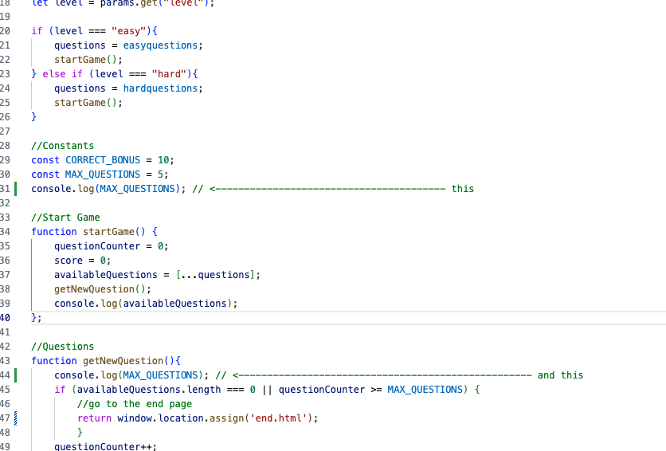

# Classical Music Quiz

[View Classical Music Quiz Website](https://charlieburton10.github.io/classicalmusicquiz/)

---

## CONTENTS
* [Rationale](#rationale)
  * [Project Introduction](#project-introduction)
  * [Motivation and Inspiration](#motivation-and-inspiration)
  * [Project Scope and Limitations](#project-scope-and-limitations)

* [User Experience](#user-experience-ux)
  * [Site Goals](#site-goals)
  * [User Stories](#user-stories)

* [Design](#design)
  * [Colour Scheme](#colour-scheme)
  * [Typography](#typography)
  * [Imagery](#imagery)
  * [Wireframes](#wireframes)

* [Features](#features)
  * [General Features on Each Page](#general-features-on-each-page)
  * [Future Implementations](#future-implementations)
  * [Accessibility](#accessibility)

* [Technologies Used](#technologies-used)
  * [Languages Used](#languages-used)
  * [Frameworks, Libraries & Programs Used](#frameworks-libraries--programs-used)

* [Deployment & Local Development](#deployment--local-development)
  * [Deployment](#deployment)
  * [Local Development](#local-development)
    * [How to Fork](#how-to-fork)
    * [How to Clone](#how-to-clone)

* [Testing](#testing)
  * [W3C Validator](#w3c-validator)
  * [Solved Bugs](#solved-bugs)
  * [Testing User Stories](#testing-user-stories)
  * [Performance Testing](#performance-testing)
  * [Further Testing](#further-testing)
  * [Manual Testing](#manual-testing)

* [Credits](#credits)
  * [Code Used](#code-used)
  * [Tutorials](#tutorials)
  * [Background Image](#background-image)
  * [Quiz Questions](#quiz-questions)
  * [Acknowledgments](#acknowledgments)

---
## Rationale

### Project Introduction
An opportunity to test and enhance your classical music with this 2 level quiz. Whether you are a beginner or an experienced musician, this quiz is designed to challenge and help expand your classical music knowledge. The quiz has 40 questions spread over 2 levels of difficulty, easy or hard, the user will be given a random 5 questions, worth 10 points a question and 45 seconds to complete the quiz. The timer that has been added to encourage the user to think fast under time pressure.

### Motivation and Inspiration
Music is a part of everday life and has a significant impact on us all as humans. Classical music, in particular, is used for many aspects of media and advertising and whilst people may propose that they have little or no knowledge of the idiom, they are subjected to it frequently. This quiz provides the opportunity for the player to test their knoweledge at various levels.

The inspiration for creating this quiz is to produce a quiz that is accessible to all rather than just classical music fans, by doing so I hope to inspire those who have a limited knowledge of the genre to become more interested in it.

### Project Scope and Limitations

The scope of the project includes the creation of an online classical quiz with the features focusing on usability on mulitple devices and accessbility for anyone to be able to take part.

The known limitation is the quiz currently only has 40 questions spread over 2 levels of difficulty, easy or hard. So after playing the quiz a few time the visitor would start seeing some of the same questions. To solve this limitation I would expand the number of questions in both the easy and hard js files and potentially add a medium level of difficulty.

## User Experience (UX)

### Site Goals
* I want the userbto be able to view the site on a range of device sizes.
* I want the site to be attractive, responsive and easy to use for the user.
* I want the site to work as intended incrementing the questions and score as the user progresses, with the timer going down for each question.
* I want the user to have a varied choice of questions.
* I want the site to be user friendly and for all ages.

### User Stories

#### First Time Visitor Goals

* I want to be able to understand the rules.
* I want to be able to navigate the site easily to find information.
* I want to be able to find their social media pages.
* I want the game to be responsive to whichever device I am playing it on.
* I want to be under pressure and make the game timed.
* I want to be given a choice of varied questions.

#### Returning/Frequent Visitor Goals

* I want to be able to progress on to the hard level.
* I want to be given varied questions each time I play.
* I want to be able to easily follow them on social media pages.

## Design

### Colour Scheme

The website uses a palette of black and white to depict sheet music. The colour palette was created using the [Coolors](https://coolors.co/) website.

### Typography

I have used Open Sans from Google Fonts for this website. It is a serif font.

### Imagery

The background image has been been pick for it's classic look. I have credited this at the end.

### Wireframes

Wireframes were created for mobile, tablet and desktop.

## Features

The website is comprised of a home page, a quiz page, a contact page & an end page.

### General features on each page

All Pages on the website are responsive and have:

* A favicon in the browser tab.

* All Pages on the website have:

  * To the right of the navigation bar are the links to the websites pages. 

    

  * In the middle is the Title and tag line.

    

  * A footer which contains social media icon links to Facebook, Instagram and Twitter. 

    

* Home Page

  * Explains the rules of the game.
  * Option buttons - for easy or hard quiz

* Quiz Page

  * Runs the quiz.
  * Has a timer, question counter and score counter.
  
* Contact Page

  * Has a form for users to send us their comments.

* End Page

  * Gives user their final score.
  * Offers them to retake current level or try a different level of quiz.

* 404.html
  * Redirects the user back to index.html to prevent them having to press the browser back button for better experience.

### Future Implementations

* Add a leaderboard.
* Add more questions.

### Accessibility

 * I have made sure there is colour contrast on the site. 
 * I have used semantic HTML. 
 * I have used a hover state on all buttons on the site to make it clear to the user if they are hovering over a button.

## Technologies Used

### Languages Used

* HTML, CSS and JavaScript were used to create this website.

### Frameworks, Libraries & Programs Used

* [Balsamiq](https://balsamiq.com/) - Used to create wireframes.

* [Git](https://git-scm.com/) - For version control.

* [Github](https://github.com/) - To save and store the files for the website.

* [GitPod](https://gitpod.io/) - IDE used to create the site.

* [Google Fonts](https://fonts.google.com/) - To import the fonts used on the website.

* [jQuery](https://jquery.com/) - A JavaScript library.

* [Google Developer Tools](https://developers.google.com/web/tools) - To troubleshoot and test features, solve issues with responsiveness and styling.

* [TinyPNG](https://tinypng.com/) To compress image.

* [Image Resizer](https://imageresizer.com/) To resize image.

* [Favicon.io](https://favicon.io/) To create favicon.

* [Am I Responsive?](http://ami.responsivedesign.is/) To show the website image on a range of devices.

* [Webpage Spell-Check](https://chrome.google.com/webstore/detail/webpage-spell-check/mgdhaoimpabdhmacaclbbjddhngchjik/related) - a google chrome extension that allows you to spell check your webpage. Used to check the site and the readme for spelling errors.

## Deployment & Local Development

### Deployment

Github Pages was used to deploy the live website. The instructions to achieve this are below:

1. Log in to Github.
2. Find the repository for this project, classicalmusicquiz.
3. Click on the Settings button.
4. Click on the Pages button in the left hand side bar.
5. In the Source section, choose main from the drop down select branch menu. Select Root from the drop down select folder menu.
6. Click Save. Your live Github Pages site is now deployed at the URL shown.

### Local Development

The local development section gives instructions on how someone else could make a copy of your project to play with on their local machine. This section will get more complex in the later projects, and can be a great reference to yourself if you forget how to do this.

#### How to Fork

To fork classicalmusicquiz repository:

1. Log in to Github.
2. Go to the repository for this project, CharlieBurton10/classicalmusicquiz
3. Click the Fork button at the top of the page between Watch and Starred.

#### How to Clone

To clone classical music quiz repository:

1. Log in to Github.
2. Go to the repository for this project, CharlieBurton10/classicalmusicquiz
3. Click on the code button, select whether you would like to clone with HTTPS, SSH or GitHub CLI and copy the link shown.
4. Open the terminal in your code editor and change the current working directory to the location you want to use for the cloned directory.
5. Type 'git clone' into the terminal and then enter.
6. Then paste link from step 3 ($ git clone https://github.com/CharlieBurton10/classicalmusicquiz) and then press enter.

## Testing

Testing has been on going throughout the build with Chrome developer tools.

### W3C Validator

The W3C validator was used to validate the HTML on all pages of the website. It was also used to validate CSS in the style.css file.

[Index Page HTML](docs/testing/w3cindex.png) - Passed

[Quiz Easy Level Page HTML](docs/testing/w3cquizeasy.pgn) - Passed

[Quiz Hard Level Page HTML](docs/testing/w3cquizhard.pgn) - Passed

[End Quiz Page HTML](docs/testing/w3cquizend.pgn) - 1 warning for an empty heading. This has now been given a value.

[Contact Page HTML](docs/testing/w3ccontact.png) - Passed

[404 Page HTML](docs/testing/w3c404.png) - Passed

[CSS](docs/testing/w3ccss.png) - Passed

### Solved Bugs

1. The below error was occuring on the console. I tried to fix the bug and also googled how to resolve it, as I had already made MAX_QUESTIONS a Const. I ended up talking to my subsitute mentor Tim about the bug. The bug was happening because the if/else statement for the page parameters "level" is above the const variables, so it was calling startGame() which calls getNewQuestion() before the const vars are added. I was able to fix the bug by moving the if/else statement below the const stuff, so that let  and const are above everything else.

2. The below error was occuring on the console for both the index.html and end.html page but not for the quiz.html page. This occured because the timer was trying to. start with the index.html and end.html page. I ended up putting the timer and quiz in a seperate javaScript file called quiz.js which solved this bug.

### Testing User Stories

#### First Time Visitor Goals

* I want to be able to understand the rules.
  * The rules for the quiz are sat on the home page.

  
* I want to be able to navigate the site easily to find information.
  * All site navigation is in the top right corner on every page of the website.

  
* I want to be able to find their social media pages.
  * In the footer on every page sits links to the social media pages.

  
* I want the game to be responsive to whichever device I am playing it on.
  * I have checked that the quiz is responsive on multiple devices.

* I want to be under pressure and make the game timed.
  * I have added a time for the quiz to be completed in 45 seconds.

  
* I want to be given a choice of varied questions.
  * I have given 20 questions for each level which are randomly choosen for the visitor of the quiz.

#### Returning/Frequent Visitor Goals

* I want to be able to progress on to the hard level.
  * I have given the user the option at the end of the game to either retake the easy level or progress to the hard level.

  
* I want to be given varied questions each time I play.
  * I have given 20 questions for each level which are randomly choosen for the visitor of the quiz.

* I want to be able to easily follow them on social media pages.
  * In the footer on every page sits links to the social media pages.

    

### Performance Testing

[Google Lighthouse](https://developers.google.com/web/tools/lighthouse/) was used to measure the performance and speed of the website. 

|     Page      |     Mobile    |    Desktop    |
| ------------  | ------------- | ------------- |
|  index.html   |    [Result](docs/testing/lighthouse/indexmobile.png)   |    [Result](docs/testing/lighthouse/indexdesktop.png)  | 
|  quiz.html    |    [Result](docs/testing/lighthouse/quizmobile.png)    |    [Result](docs/testing/lighthouse/quizdesktop.png)   | 
|  end.html     |    [Result](docs/testing/lighthouse/endmobile.png)     |    [Result](docs/testing/lighthouse/enddesktop.png)    |  
|  contact.html |    [Result](docs/testing/lighthouse/contactmobile.png) |    [Result](docs/testing/lighthouse/indexdesktop.png)  | 

### Further Testing

 * The website was tested on Google Chrome, Safari and Microsoft Edge browsers.
 * The website was tested on multiple devices: Desktop, Mackbook 14inch, iPad Pro and iPhone 14.
 * All browsers and devices were tested on all pages to make sure all the pages and links are working properly.

### Manual Testing

#### All pages
Feature | Expected Outcome	| Testing Performed |	Result	| Pass/Fail |
| --- | --- | --- | --- | --- |
| Nav links:hover | Text change colour when links are hovered | Hovered over each header link | Colour changed | Pass |
| Nav links| Launches / Resets Home and Contact Page| Clicked the Nav Links| Home or Contact page launched | Pass |
| "Easy" Button | Launches Easy game on click / enter press | Clicked "Easy" button | Easy Game launched | Pass | 
| "Hard" Button | Launches Hard game on click / enter press | Clicked "Hard" button | Hard Game launched | Pass | 
| Social Media links| Text change colour when links are hovered | Hovered over each header link | Colour changed | Pass |

#### quiz.html
Feature | Expected Outcome	| Testing Performed |	Result	| Pass/Fail |
| --- | --- | --- | --- | --- |
| Answers:hover | Background change colour when the mouse hovers | Hovered over any answer | Colour changed | Pass |
| Answers:clicked | Background change colour when clicked | Clicked any answer | Colour changed green for correct answer and red for wrong answer  | Pass |
| Answers:clicked | New question appears| Clicked an answer | Next question appeared | Pass |
| Timer alert | Timer alert when timer runs out | Let the timer run out | Alert boxed launched with "OK" button | Pass |
| "OK" alert button | Resets quiz | Clicked "OK" button | Reset quiz | Pass |
| 5 questions answered | end.html launched with final score | Completed quiz answering 5 questions | end.html appeared | Pass

#### contact.html
Feature | Expected Outcome	| Testing Performed |	Result	| Pass/Fail |
| --- | --- | --- | --- | --- |
All fields on form required | Hint to let user there is an empty field | Tried leaving field empty and then clicked submit |Prompt "Please fill in this field" | Pass 

## Credits

### Code Used

* [SitePoint](https://www.sitepoint.com/simple-javascript-quiz/#thebasicstructureofyourjavascriptquiz) Countdown timer for the quiz.

### Tutorials

*  [James Q Quick](https://www.youtube.com/playlist?list=PLDlWc9AfQBfZIkdVaOQXi1tizJeNJipEx) YouTube course was used to help me create this game. It provided a strong foundation to build on to help me achieve the results I wanted. 

###  Background Image

* [Freepik](https://img.freepik.com/free-vector/vector-abstract-musical-background-vector-illustration_206725-624.jpg?t=st=1721989267~exp=1721992867~hmac=2878b2832f83df143a5040ea248d5c22c5d3bd7c1e52420aad3349896554bd33&w=1380) Image by almumtazza on Freepik.

### Quiz questions

* [Sporcle](https://www.sporcle.com/games/biggs364/classical-music-easy-to-hard) Questions for both easy and hard.

  
###  Acknowledgments

 * My Code Institute Mentor, Can Sucullu for his helpful feedback and support.
 * Subsitute Code Insistue Mentor, Tim Nelson for his helpful feedback and support.
 * Tutor Support at Code Institute.